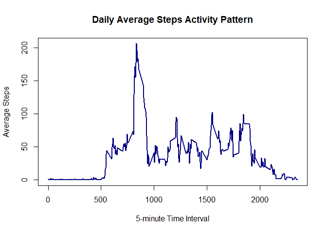
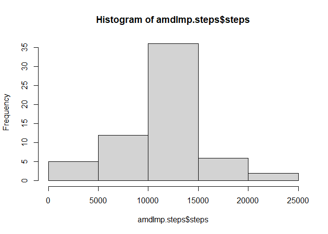
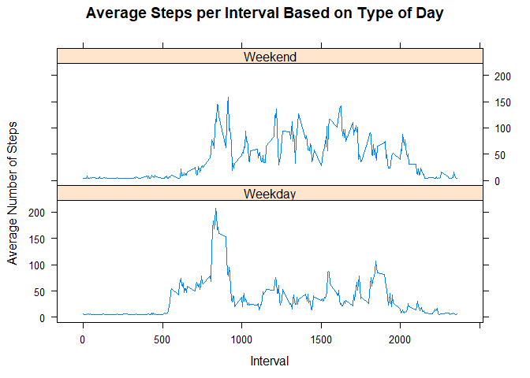

## Loading and preprocessing the data


```r
unzip(zipfile = "activity.zip", exdir = getwd())
amd<-read.csv("activity.csv")
amd$date <-as.Date(amd$date,format="%Y-%m-%d")
```

## What is mean total number of steps taken per day?

The mean of steps per day is 10766 and the median is 10765 


```r
library(dplyr)
amstp <- summarise(group_by(amd, date), steps=sum(steps))
summary(amstp$steps)
```

```
##    Min. 1st Qu.  Median    Mean 3rd Qu.    Max.    NA's 
##      41    8841   10765   10766   13294   21194       8
```

## What is the average daily activity pattern?


```r
amint<-summarise(group_by(amd, interval), stepm=mean(steps, na.rm=TRUE))
plot(x = amint$interval, y = amint$stepm, type = "l", col = "navy", lwd = 2, xlab = "5-minute Time Interval", ylab = "Average Steps", main = "Daily Average Steps Activity Pattern")
```

<!-- -->


```r
MaxInt <- amint$interval[which.max(amint$stepm)]
print(MaxInt)
```

```
## [1] 835
```

The 835 is the 5-minute interval that contains the maximum number of steps


## Imputing missing values

The structure of missing data is as follow


```r
library(mice)
md.pattern(amd)
```

<!-- -->

```
##       date interval steps     
## 15264    1        1     1    0
## 2304     1        1     0    1
##          0        0  2304 2304
```

There are 2304 missing data in the steps variable.  
The missing values are changed by the mean of steps per day 


```r
amdImp<-amd
amdImp$steps.Imp <-ifelse(is.na(amdImp$steps), mean(amdImp$steps, na.rm=TRUE), amdImp$steps)
```

amdImp data frame does not have missing data in the steps variable. 


```r
amdImp.steps <- summarise(group_by(amdImp, date), steps=sum(steps.Imp))
mean<-round(mean(amdImp.steps$steps, na.rm = TRUE), digits = 0)
median<-round(median(amdImp.steps$steps, na.rm = TRUE), digits = 0)
n.step1<-round(sum(amd$steps, na.rm=TRUE),digits = 0)
n.step2<-round(sum(amdImp.steps$steps), digits = 0)
hist(amdImp.steps$steps,breaks = "Sturges")
```

<!-- -->

The new histogram show a similar distribution as the no imputed data histogram. The mean and median (10766, 10766) do not differ from the estimates of the no imputed data. But the total daily number of steps is increased, from 570608 to 656738.  

## Are there differences in activity patterns between weekdays and weekends?


There are differences in activity patterns between weekdays and weekends. 
The average of weekend steps is greater than the steps of the weekdays.  


```r
amdImp$dayTp<-ifelse(weekdays(amdImp$date) %in% c("sábado", "domingo"), "Weekend", "Weekday")
amdImp.dayTp<-summarise(group_by(amdImp, interval, dayTp), steps=mean(steps.Imp, na.rm=TRUE))
xyplot(steps~interval|dayTp, data=amdImp.dayTp, type="l",  layout = c(1,2),
       main="Average Steps per Interval Based on Type of Day", 
       ylab="Average Number of Steps", xlab="Interval")
```

<!-- -->


